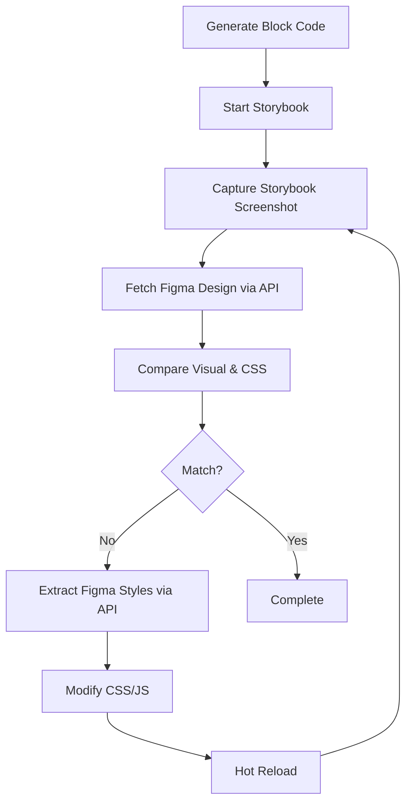

# Figma-Storybook Visual Validation Loop

**Purpose**: Automatically compare Figma design with Storybook implementation and iteratively fix discrepancies.

---

## Workflow



---

## Implementation Steps

### Step 1: Figma API Integration

```javascript
// scripts/compare-figma-storybook.js

import { chromium } from 'playwright';

/**
 * Fetch precise CSS from Figma API
 */
async function fetchFigmaStyles(nodeId) {
  const response = await fetch(
    `https://api.figma.com/v1/files/${FILE_ID}/nodes?ids=${nodeId}`,
    {
      headers: {
        'X-Figma-Token': process.env.FIGMA_PERSONAL_ACCESS_TOKEN,
      },
    }
  );
  
  const data = await response.json();
  const node = data.nodes[nodeId].document;
  
  return {
    backgroundColor: node.fills[0]?.color,
    fontSize: node.style?.fontSize,
    fontFamily: node.style?.fontFamily,
    color: node.style?.color,
    borderRadius: node.cornerRadius,
    padding: node.paddingLeft,
    // ... extract all CSS properties
  };
}

/**
 * Export SVG from Figma
 */
async function fetchFigmaSVG(nodeId) {
  const response = await fetch(
    `https://api.figma.com/v1/images/${FILE_ID}?ids=${nodeId}&format=svg`,
    {
      headers: {
        'X-Figma-Token': process.env.FIGMA_PERSONAL_ACCESS_TOKEN,
      },
    }
  );
  
  const data = await response.json();
  const svgUrl = data.images[nodeId];
  
  const svgResponse = await fetch(svgUrl);
  return await svgResponse.text();
}
```

### Step 2: Storybook Screenshot Capture

```javascript
/**
 * Capture Storybook screenshot
 */
async function captureStorybook(storyUrl) {
  const browser = await chromium.launch();
  const page = await browser.newPage();
  
  await page.goto(storyUrl);
  await page.waitForLoadState('networkidle');
  
  const screenshot = await page.screenshot();
  const computedStyles = await page.evaluate(() => {
    const element = document.querySelector('.hero');
    const styles = window.getComputedStyle(element);
    
    return {
      backgroundColor: styles.backgroundColor,
      fontSize: styles.fontSize,
      fontFamily: styles.fontFamily,
      color: styles.color,
      borderRadius: styles.borderRadius,
      padding: styles.padding,
    };
  });
  
  await browser.close();
  
  return { screenshot, computedStyles };
}
```

### Step 3: Visual Comparison

```javascript
/**
 * Compare Figma vs Storybook
 */
function compareStyles(figmaStyles, storybookStyles) {
  const differences = [];
  
  for (const [key, figmaValue] of Object.entries(figmaStyles)) {
    const storybookValue = storybookStyles[key];
    
    if (figmaValue !== storybookValue) {
      differences.push({
        property: key,
        figma: figmaValue,
        storybook: storybookValue,
      });
    }
  }
  
  return differences;
}
```

### Step 4: Automatic Code Modification

```javascript
/**
 * Apply fixes to CSS based on Figma API data
 */
async function applyFixes(blockName, differences) {
  const cssPath = `blocks/${blockName}/${blockName}.css`;
  let cssContent = await fs.readFile(cssPath, 'utf-8');
  
  for (const diff of differences) {
    const { property, figma } = diff;
    
    // Update CSS
    const cssProperty = camelToKebab(property);
    const regex = new RegExp(`${cssProperty}:\\s*[^;]+;`);
    
    if (regex.test(cssContent)) {
      cssContent = cssContent.replace(
        regex,
        `${cssProperty}: ${figma};`
      );
    } else {
      // Add new property
      cssContent = cssContent.replace(
        /\.${blockName}\s*\{/,
        `.${blockName} {\n  ${cssProperty}: ${figma};`
      );
    }
  }
  
  await fs.writeFile(cssPath, cssContent);
  console.log(`✅ Applied ${differences.length} fixes to ${cssPath}`);
}
```

### Step 5: Iterative Loop

```javascript
/**
 * Main validation loop
 */
async function validateAndFix(blockName, figmaNodeId, maxIterations = 5) {
  let iteration = 0;
  let allMatched = false;
  
  console.log(`🔄 Starting Figma-Storybook validation loop for ${blockName}...`);
  
  while (!allMatched && iteration < maxIterations) {
    iteration++;
    console.log(`\n📍 Iteration ${iteration}/${maxIterations}`);
    
    // 1. Fetch Figma styles
    console.log('📥 Fetching Figma styles...');
    const figmaStyles = await fetchFigmaStyles(figmaNodeId);
    
    // 2. Capture Storybook
    console.log('📸 Capturing Storybook...');
    const storyUrl = `http://localhost:6006/?path=/story/blocks-${blockName}--default`;
    const { computedStyles } = await captureStorybook(storyUrl);
    
    // 3. Compare
    console.log('🔍 Comparing styles...');
    const differences = compareStyles(figmaStyles, computedStyles);
    
    if (differences.length === 0) {
      console.log('✅ All styles match!');
      allMatched = true;
    } else {
      console.log(`⚠️  Found ${differences.length} differences:`);
      differences.forEach(diff => {
        console.log(`   - ${diff.property}: Figma="${diff.figma}" vs Storybook="${diff.storybook}"`);
      });
      
      // 4. Apply fixes
      console.log('🔧 Applying fixes...');
      await applyFixes(blockName, differences);
      
      // 5. Wait for hot reload
      console.log('⏳ Waiting for hot reload...');
      await new Promise(resolve => setTimeout(resolve, 2000));
    }
  }
  
  if (allMatched) {
    console.log(`\n🎉 Validation complete! ${blockName} matches Figma design.`);
  } else {
    console.log(`\n⚠️  Max iterations reached. Some differences may remain.`);
  }
}
```

---

## Usage

### CLI Command

```bash
# Start Storybook first
npm run storybook

# In another terminal, run validation
node scripts/compare-figma-storybook.js --block=hero --node-id=2-1446
```

### Integrated into Block Generation

Add to `.cursorrules`:

```markdown
### 8. Post-Generation Visual Validation (Optional)

After generating block files, optionally run automatic Figma-Storybook validation:

1. Start Storybook: `npm run storybook`
2. Run validation loop:
   ```bash
   node scripts/compare-figma-storybook.js --block=<name> --node-id=<figma-node-id>
   ```
3. The script will:
   - Fetch precise CSS from Figma API
   - Capture Storybook screenshot and computed styles
   - Compare and identify differences
   - Automatically modify CSS to match Figma
   - Repeat until styles match or max iterations reached

**When to use:**
- ✅ For pixel-perfect accuracy requirements
- ✅ When Figma design has complex styling
- ✅ To validate generated code immediately

**When to skip:**
- ❌ For simple blocks with straightforward styling
- ❌ When manual review is preferred
```

---

## Demo Script

```bash
# 1. Generate block
@figma https://www.figma.com/design/FILE_ID/...?node-id=2-1446
Generate EDS Block for "Hero"

# 2. Start Storybook
npm run storybook

# 3. Run validation loop (in another terminal)
node scripts/compare-figma-storybook.js --block=hero --node-id=2-1446 --demo

# Expected output:
# 🔄 Starting Figma-Storybook validation loop for hero...
# 
# 📍 Iteration 1/5
# 📥 Fetching Figma styles...
# 📸 Capturing Storybook...
# 🔍 Comparing styles...
# ⚠️  Found 3 differences:
#    - backgroundColor: Figma="rgb(26,73,137)" vs Storybook="rgb(255,255,255)"
#    - fontSize: Figma="48px" vs Storybook="32px"
#    - padding: Figma="64px" vs Storybook="24px"
# 🔧 Applying fixes...
# ✅ Applied 3 fixes to blocks/hero/hero.css
# ⏳ Waiting for hot reload...
# 
# 📍 Iteration 2/5
# ...
# ✅ All styles match!
# 🎉 Validation complete! hero matches Figma design.
```

---

## Benefits

1. **Pixel-Perfect Accuracy**: Uses Figma API for exact CSS values
2. **Automated Iteration**: No manual comparison needed
3. **Fast Feedback**: Hot reload shows changes immediately
4. **Traceable**: Logs all differences and fixes
5. **Configurable**: Set max iterations, tolerance levels

---

## Limitations

1. **Complex Layouts**: May not handle all layout patterns
2. **Dynamic Content**: Requires static content for comparison
3. **Figma API Limits**: Rate limits may apply
4. **Manual Review Still Needed**: For semantic correctness

---

## Next Steps

To implement this for demo:

1. Create `scripts/compare-figma-storybook.js`
2. Add npm script: `"validate-block": "node scripts/compare-figma-storybook.js"`
3. Update `.cursorrules` with validation step
4. Test with one block (e.g., Hero)
5. Demo the full loop
