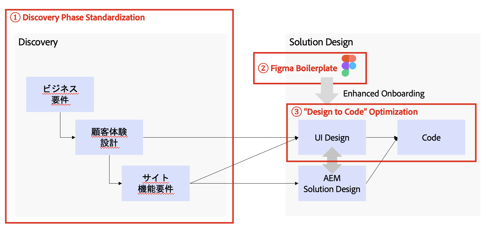
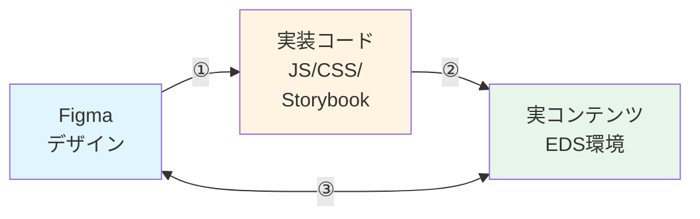
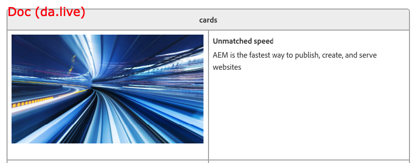
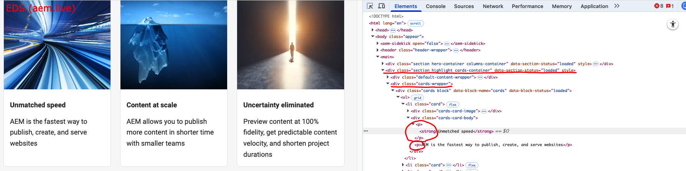
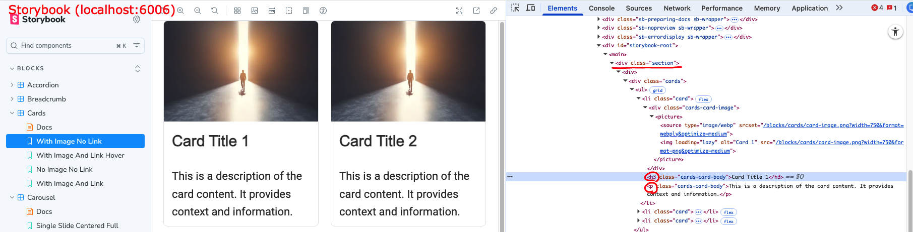
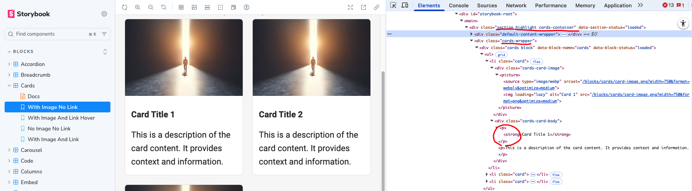
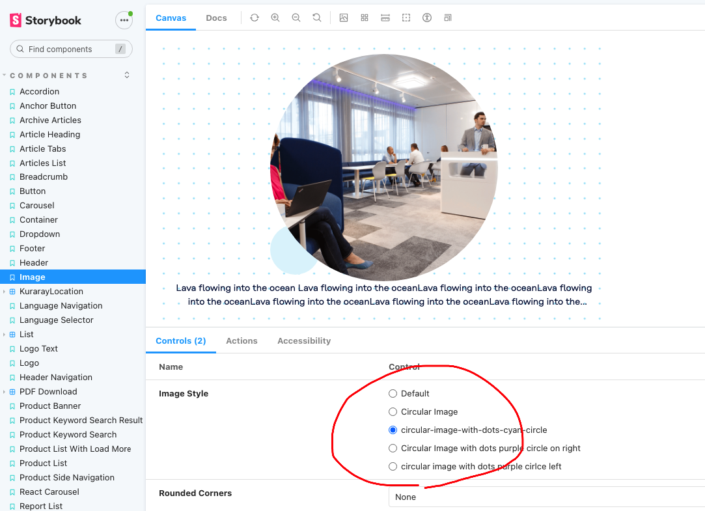
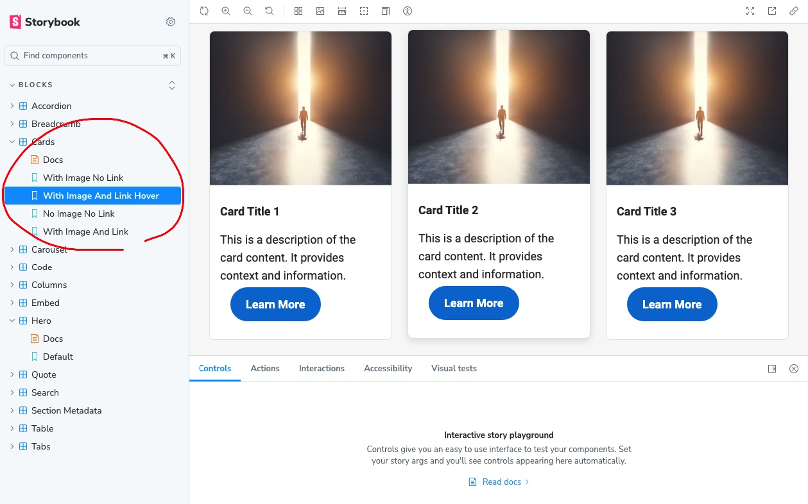
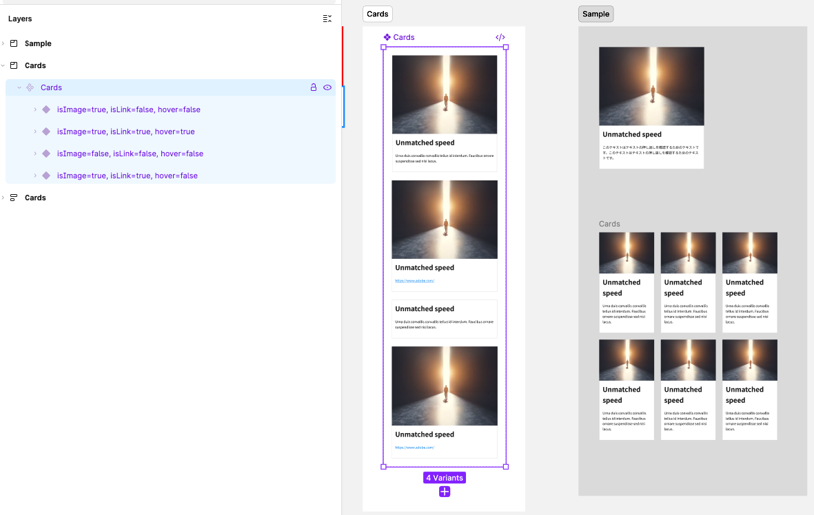

# D2C - Design to Code Gitテンプレート

**プロジェクト**: フロントエンドの不具合撲滅運動  
**正式名称**: Design to Code Gitテンプレート（D2C）  
**テンプレートリポジトリ**: N/A(いまはPrivateリポジトリで検証中  
**目的**: FigmaデザインからEDSブロックを自動生成し、Visual Regression Testingで品質担保

## 🎯 このプロジェクトが解決する課題

### サイト構築フェーズとD2Cの位置づけ

AEM（Adobe Experience Manager）を使用したサイト構築は、以下のようなフェーズで進行します<br/>
D2Cプロジェクトは、この中の**「デザイン（Figma）」から「コード実装」、そして「改修・保守」**に至るフェーズに焦点を当てています。




---

### D2Cが取り組む2つの課題領域

D2Cプロジェクトは、**2つの大きな課題領域**に対してアプローチします：

### 課題1: デザインと実装の「不一致」を引き起こす境界への対応

- Figmaデザイン、実装コード、EDS実環境という3つの表現形式の間に存在する境界で発生する「不一致」「不整合」

### 課題2: ブロック改修による「デグレ（Regression）」の防止と検知

- 既存ブロックの改修や共通スタイルの変更が、意図しない副作用（デグレ）を引き起こすリスク

<br/><br/><br/><br/><br/>


## 📋 課題1: デザインと実装の「不一致」を引き起こす境界

### 問題の本質：「不一致」を引き起こす3つの境界

EDSブロック開発において、**3つの異なる表現形式**が存在し、それぞれの境界で「不一致」が発生します：



**3つの境界**：
- **① Figma vs 実装コード**: HTML構造の推測が必要
- **② 実装コード vs 実コンテンツ**: EDS構造の理解が必要  
- **③ Figma vs 実コンテンツ**: ①+②が達成されれば理論上一致

---

### ① **Figma vs 実装コード** - 構造変換の限界

**問題**:
- ❌ FigmaはデザインツールでHTMLを保持していない
- ❌ CSS的なヒント（Layout, Visual, Typography）はあるが、HTMLの構造情報はない
- ❌ ノード階層から適切なHTML要素（h1/div/button）を**類推**する必要がある

**具体例（Carouselブロック）**:
```
Figma:
  Carousel (COMPONENT_SET)
  └── isSingle=false, isMultiple=true, isContent=true, center, full
      ├── slider (FRAME)
      │   ├── image (FRAME)
      │   │   └── image (IMAGE)
      │   └── contents (FRAME)
      │       ├── left-icon (FRAME)
      │       │   └── carousel-icon > arrow > arrow > Arrow (ICON)
      │       ├── content (FRAME)
      │       │   └── carousel content (FRAME)
      │       │       ├── Headings (INSTANCE)
      │       │       │   └── Heading (TEXT)
      │       │       ├── Text (INSTANCE)
      │       │       │   └── テキストコンテンツ (TEXT)
      │       │       └── Buttons (INSTANCE)
      │       │           └── Button (COMPONENT)
      │       └── right-icon (FRAME)
      │           └── carousel-icon > arrow (ICON)
      └── indicators (FRAME, Auto Layout: Horizontal)
          ├── indicator (ELLIPSE - 紫円)
          ├── indicator (ELLIPSE - 紫円)
          ├── indicator (ELLIPSE - 紫円)
          ├── indicator (ELLIPSE - 紫円)
          └── indicator (ELLIPSE - 紫円)

AIの類推:
  ✅ slider > image > image → <picture></picture> と判断（EDS標準）
  ✅ left-icon/right-icon + Arrow → <button class="carousel-prev/next"> と判断
  ✅ Headings (INSTANCE) > Heading → <h2> または <h3> と判断
  ✅ Text (INSTANCE) → <p> と判断
  ✅ Buttons (INSTANCE) > Button → <a class="button"> と判断
  ✅ indicators + ELLIPSE → <ul class="carousel-indicators"><li> と判断
  ✅ contents + Auto Layout → <div class="carousel-content"> with flexbox と判断
  ⚠️ Frame構造 → <div> 階層と判断（意味的な要素名は推測が必要）
  ⚠️ Headings/Text/Buttons が INSTANCE → 実際の要素を展開する必要がある
```

**限界**:
- ✅ CSSは高精度で変換可能（Auto Layout → Flexbox など）
- ⚠️ HTML構造は推測を含むため、**100%同じになる保証はない**
- ✅ ただし、D2Cの自動検証ループで**視覚的には95%以上一致**を達成

**D2Cの対策**:
- boundVariables優先でデザイントークン使用率90%以上
- FigmaとStorybookの画像比較で視覚的差分を5%以下に自動修正
- ノード名（"Title", "Navigation", "Indicators" など）から要素を推測

---

### ② **実装コード vs 実コンテンツ** - EDS構造の理解

**問題**:
- ❌ EDSコアロジックが生成するHTML構造を正確に模倣できていないと、**StorybookとEDS実環境で見た目が変わる**
- ❌ Storybookで「Figmaと同じ」と確認しても、実環境で「違う」となる

**EDSの仕組み**:

Adobe Edge Delivery Services（EDS）では、以下の変換が行われます：

```
Document (Markdown/Table)
  ↓ (1) EDS Core Logic
HTML (with Wrappers)
  ↓ (2) decorate(block)
Final HTML
```

#### 具体例：Cardsブロックの変換過程

**Step 1: Document Authoring（実コンテンツ編集）**

実際のEDS環境では、コンテンツ編集者がGoogle DocsやSharePointで以下のように編集します：

```markdown
| Cards |
|-------|
|  |
| **Card Title 1** |
| Card description text goes here. |
|  |
| **Card Title 2** |
| Card description text goes here. |
|  |
| **Card Title 3** |
| Card description text goes here. |
```



**Step 2: EDS Core Logicが生成するHTML（実環境）**



**EDS実環境のHTML構造**:
- ✅ 外側に `.cards-wrapper` が存在
- ✅ `.cards.block` に `data-block-name` と `data-block-status` 属性
- ✅ `<ul><li>` のリスト構造
- ✅ 画像は `<picture>` で包まれている
- ✅ カードボディは `<div class="cards-card-body">` の中に2つの `<p>` タグ
- ⚠️ タイトルは `<p><strong>タイトル</strong></p>`（`<h3>` ではない）

**Step 3: D2Cで生成したStorybook実装（最終HTML）**



**Storybook実装のHTML構造**:
- ✅ `<main>` > `.section` > `<div>` > `.cards` の階層
- ❌ `.cards-wrapper` や `data-block-*` 属性は**ない**
- ✅ `<ul><li>` のリスト構造
- ✅ 画像は `<picture>` で包まれている
- ⚠️ タイトルは `<h3 class="cards-card-body">`（セマンティック）
- ⚠️ タイトルと説明文が並列（EDS実環境では `<div class="cards-card-body">` で包まれている）

#### StorybookとEDS実環境の主な差異

| 要素 | Storybook（D2C生成） | EDS実環境 |
|------|---------------------|-----------|
| **最外ラッパー** | `<main>` | `<div class="cards-wrapper">` |
| **section構造** | `<div class="section"><div>` | なし（`.cards-wrapper`が直接親） |
| **Block属性** | `.cards`のみ | `.cards.block` + `data-block-name` + `data-block-status` |
| **リスト構造** | `<ul><li class="card">` | `<ul><li class="card">` ✅ 同じ |
| **画像** | `<picture>` | `<picture>` ✅ 同じ |
| **カードボディ** | タイトルと説明文が並列 | `<div class="cards-card-body">` で包まれている |
| **タイトル** | `<h3 class="cards-card-body">` | `<p><strong>` を含む `<div class="cards-card-body">` 内 |
| **説明文** | `<p class="cards-card-body">` | `<p>` を含む `<div class="cards-card-body">` 内 |

**重要な違い**:

1. **Wrapper構造の違い**
   - EDS: `.cards-wrapper` > `.cards.block`
   - Storybook: `<main>` > `.section` > `<div>` > `.cards`

2. **Block属性の有無**
   - EDS: `data-block-name="cards"` と `data-block-status="loaded"` が必須
   - Storybook: これらの属性がない

3. **カードボディの構造**
   - EDS: `<div class="cards-card-body">` の中に `<p><strong>タイトル</strong></p>` と `<p>説明文</p>`
   - Storybook: `<h3 class="cards-card-body">タイトル</h3>` と `<p class="cards-card-body">説明文</p>` が並列

4. **タイトルのタグ**
   - EDS: `<p><strong>タイトル</strong></p>`（Bold化された段落）
   - Storybook: `<h3>タイトル</h3>`（セマンティックな見出し）

#### なぜこの差異が問題になるのか？

**CSSセレクタの不一致**:
```css
/* Storybook用のCSS（動作しない） */
.cards h3 {
  font-size: 24px;
  font-weight: bold;
}

/* EDS実環境では h3 が存在しないため、スタイルが適用されない */
/* 実際は .cards-card-body p strong をターゲットにする必要がある */
```

**JavaScript DOM操作の不一致**:
```javascript
// Storybookを前提としたコード（動作しない）
const titles = block.querySelectorAll('h3');  // EDS環境では0件

// EDS実環境に対応したコード
const titles = block.querySelectorAll('.cards-card-body p strong');  // 正しく取得
```

**レイアウトの崩れ**:
- Storybookで `<h3>` と `<p>` が並列 → Flexbox等で水平方向の制御
- EDS実環境では `<div class="cards-card-body">` で包まれている → 垂直方向のレイアウトに影響

#### 正しい対応策：ローカルEDS環境を参照してHTML構造を揃える

**D2Cのアプローチ**:

D2Cでは、ブロック生成時に**ローカルのEDS環境を参照**することで、EDSコアロジックが生成するHTML構造を正確に把握し、Storybookで同じ構造を再現します。

**Step 1: ローカルEDS環境でHTML構造を確認**

```bash
# ローカルでEDS環境を起動
aem up

# ブラウザでHTMLを確認
http://localhost:3000/cards-demo
```

EDS実環境で生成されるHTML構造を確認：


**Step 2: 確認したHTML構造をStorybookで模倣**

```javascript
// blocks/cards/cards.stories.js
export const Default = {
  render: () => {
    const block = document.createElement('div');
    block.className = 'cards block';
    block.setAttribute('data-block-name', 'cards');
    block.setAttribute('data-block-status', 'loaded');
    
    // ✅ EDS実環境で decorate() が受け取る構造を正確に再現
    block.innerHTML = `
      <div>
        <div>
          <picture></picture>
        </div>
      </div>
      <div>
        <div>
          <p><strong>Card Title 1</strong></p>
          <p>Card description text goes here.</p>
        </div>
      </div>
      <div>
        <div>
          <picture></picture>
        </div>
      </div>
      <div>
        <div>
          <p><strong>Card Title 2</strong></p>
          <p>Card description text goes here.</p>
        </div>
      </div>
    `;
    
    decorate(block);  // ✅ これでEDS実環境と同じ変換が行われる
    return block;
  },
};
```



**Step 3: decorate(block)関数でEDS実環境と同じ変換を実行**

```javascript
// blocks/cards/cards.js
export default function decorate(block) {
  // ✅ EDS実環境と同じHTML構造を前提とした実装
  const ul = document.createElement('ul');
  const rows = [...block.children];
  
  rows.forEach((row) => {
    const li = document.createElement('li');
    li.className = 'card';
    
    // ✅ 画像を処理（EDSは picture タグで包まれている前提）
    const picture = row.querySelector('picture');
    if (picture) {
      const imageDiv = document.createElement('div');
      imageDiv.className = 'cards-card-image';
      imageDiv.append(picture);
      li.append(imageDiv);
    }
    
    // ✅ テキストを処理（EDSは p strong の構造）
    const cells = row.querySelectorAll(':scope > div');
    cells.forEach((cell) => {
      const bodyDiv = document.createElement('div');
      bodyDiv.className = 'cards-card-body';
      bodyDiv.innerHTML = cell.innerHTML;  // p と p strong をそのまま保持
      li.append(bodyDiv);
    });
    
    ul.append(li);
  });
  
  block.textContent = '';
  block.append(ul);
}
```

**結果**:
- ✅ StorybookとEDS実環境で**同じHTML構造**
- ✅ CSSセレクタが**両方で動作**
- ✅ JavaScriptのDOM操作が**両方で動作**
- ✅ レイアウトが**両方で一致**

**D2Cの対策**:
- ✅ AIがEDS標準パターン（`decorate(block)` のロジック）を理解してコード生成
- ✅ **ローカルEDS環境（`aem up`）を参照**してHTMLStructureを確認
- ✅ Storybook HTMLは**ローカルEDS環境を参照してEDSコアロジックが生成する構造を正確に模倣**
- ✅ `decorate(block)` 関数をStorybookでも実行して最終HTMLを確認
- ✅ **Living Specification**: EDS実環境から抽出したHTML構造を「生きた仕様」として参照
- ⚠️ タイトルが`<h3>`か`<p><strong>`かなど、細かい違いを実環境で確認してから実装

```javascript
// blocks/cards/cards.js
export default function decorate(block) {
  // EDS実環境では <ul><li> 構造が既に存在する前提
  const ul = document.createElement('ul');
  const rows = [...block.children];
  
  rows.forEach((row) => {
    const li = document.createElement('li');
    li.className = 'card';
    
    // 画像を処理
    const picture = row.querySelector('picture');
    if (picture) {
      const imageDiv = document.createElement('div');
      imageDiv.className = 'cards-card-image';
      imageDiv.append(picture);
      li.append(imageDiv);
    }
    
    // テキスト要素を処理（<p><strong>タイトル</strong></p> と <p>説明</p>）
    const paragraphs = row.querySelectorAll('p');
    if (paragraphs.length > 0) {
      const bodyDiv = document.createElement('div');
      bodyDiv.className = 'cards-card-body';
      paragraphs.forEach(p => bodyDiv.append(p.cloneNode(true)));
      li.append(bodyDiv);
    }
    
    ul.append(li);
  });
  
  block.textContent = '';
  block.append(ul);
}
```

**Storybookで正しいHTML構造を使用**:

```javascript
// ❌ BAD: EDS構造を理解していない
export const Default = {
  render: () => {
    const block = document.createElement('div');
    block.className = 'cards';
    block.innerHTML = `
      <ul>
        <li class="card">
          <div class="cards-card-image"><picture>...</picture></div>
          <h3>Card Title 1</h3>
          <p>Description...</p>
        </li>
      </ul>
    `;
    // decorate() を実行しても、EDS実環境と構造が違うため問題が出る
    return block;
  },
};

// ✅ GOOD: EDS実環境の構造を模倣
export const Default = {
  render: () => {
    const block = document.createElement('div');
    block.className = 'cards block';
    block.setAttribute('data-block-name', 'cards');
    block.setAttribute('data-block-status', 'loaded');
    
    // EDS実環境で decorate() が受け取る構造を再現
    block.innerHTML = `
      <div>
        <div>
          <picture></picture>
        </div>
      </div>
      <div>
        <div>
          <p><strong>Card Title 1</strong></p>
          <p>Card description text goes here.</p>
        </div>
      </div>
      <div>
        <div>
          <picture></picture>
        </div>
      </div>
      <div>
        <div>
          <p><strong>Card Title 2</strong></p>
          <p>Card description text goes here.</p>
        </div>
      </div>
    `;
    
    decorate(block);  // これでEDS実環境と同じ変換が行われる
    return block;
  },
};
```

**D2Cの対策**:etてコード生成
- ✅ Storybook HTMLは**EDSコアロジックが生成する構造を模倣**（2重Wrapper必須）
- ✅ `decorate(block)` 関数をStorybookでも実行して最終HTMLを確認
- ⚠️ **EDS実環境を見ながらHTML構造を調整するステップが必須**
- ⚠️ タイトルが`<h3>`か`<p><strong>`かなど、細かい違いを実環境で確認

---

### ③ **Figma vs 実コンテンツ** - 理論上の整合性

**前提**:
- ✅ ①（Figma vs 実装コード）が達成されている
- ✅ ②（実装コード vs 実コンテンツ）が達成されている

**結論**:
- ✅ 理論的には、**Figma ≈ 実コンテンツ** が成立する
- ✅ ①で視覚的に95%以上一致、②で構造が正確なら、実環境でも同等の見た目になる

**優先度**:
- ⚠️ Figmaと実コンテンツを直接比較する機械的な仕組みは**優先度低**
- ✅ ①と②を確実にすることで、③は自然と達成される

---

### D2Cの解決策: 自動生成と検証ループ

#### ✅ **① Figma vs 実装コード の解決**

**Figma → コード自動生成**
- Figma APIから直接デザイン情報を取得
- デザイントークン（CSS Custom Properties）を自動抽出
- boundVariables優先でトークン使用率90%以上を実現

**自動検証・修正ループ**
- FigmaとStorybookを画像比較（pixelmatch）
- 差分5%以下になるまで自動的にCSSを修正
- 最大5回の反復で精度95%以上を達成

#### ✅ **② 実装コード vs 実コンテンツ の解決**

**EDS標準パターンの徹底**
- AIがEDS Block Collection標準パターンを参照してコード生成
- `decorate(block)` 関数がEDSコアロジックの出力を前提とした実装
- StorybookでもEDS同等のHTML構造を使用

**EDS実環境での検証**
- ローカルEDS環境（`aem up`）で実際のHTML構造を確認
- 必要に応じてStorybook HTMLとdecorate()ロジックを調整
- Living Specification（実環境から抽出したHTML）を参照

<br/><br/><br/><br/><br/>

## 📋 課題2: ブロック改修による「デグレ（Regression）」の防止と検知

### 問題の本質

**問題**:
- ❌ ブロックを改修した際、**改修したブロック自身にデグレ**が起きていないか確認できない
- ❌ 改修が**他のブロックにデグレ**を引き起こしていないか確認できない
- ❌ 手動での視覚的確認は時間がかかり、見落としが発生しやすい
- ❌ CSSやJSの変更が意図しない副作用を生む可能性がある

**具体例**:
```
シナリオ 1: Carouselブロックの改修
  └── carousel.css の gap: 8px → 16px に変更
      ├── ✅ Carousel自身の見た目は意図通り
      └── ❌ 同じCSSクラスを使用していたHeroブロックが崩れた（デグレ）

シナリオ 2: styles.css の共通スタイル変更
  └── ボタンの padding を変更
      ├── ❌ 全ブロックのボタンが影響を受ける
      └── ❌ どのブロックに影響があるか手動チェックは困難
```


## D2Cの解決策: 2 Layer Visual Regression Testing

D2Cでは、**課題1で生成したブロック**の品質を継続的に担保するため、GitHub Actionsで自動化された**2層のVisual Regression Testing**を統合しています。

これにより、ブロック改修時のデグレを**未然に防ぎ、検知を容易**にします。


### 🏗️ アーキテクチャ

```
┌─────────────┐
│   Figma     │ ← デザインの唯一の情報源（Single Source of Truth）
└──────┬──────┘
       │ Figma API (MCP)
       ↓
┌──────────────────────────────────────────┐
│  AI (Cursor) + 自動化スクリプト           │
│  - inspect-figma: Variant検出            │
│  - extract-tokens: トークン抽出          │
│  - generate: JS/CSS/Stories生成          │
│  - validate-block: 自動検証ループ        │
└──────┬───────────────────────────────────┘
       │
       ↓
┌──────────────────────────────────────────┐
│  EDS Blocks                              │
│  blocks/{block}/                         │
│  ├── {block}.js        (実装)           │
│  ├── {block}.css       (スタイル)        │
│  ├── {block}.stories.js (Storybook)      │
│  └── assets/           (画像)           │
└──────┬───────────────────────────────────┘
       │
       ↓
┌──────────────────────────────────────────┐
│  2層 Visual Regression Testing           │
│  Layer 1: Storybook (Chromatic)          │
│  Layer 2: Playwright (Chromatic)         │
└──────┬───────────────────────────────────┘
       │
       ↓
┌──────────────────────────────────────────┐
│  GitHub Actions CI/CD                    │
│  - PR時: 自動VRテスト                     │
│  - Merge時: Baseline更新                  │
│  - PR Comment: Chromaticリンク投稿        │
└──────────────────────────────────────────┘
```

### 2 Layer Testing の内訳と役割

#### **Layer 1: Storybook Component Testing（コンポーネント単位）**

**テスト対象**: 個別のEDSブロック（例: Hero, Carousel, Cards）

**テストツール**: Storybook + Chromatic

**テストスコープ**:
- Storybookの`*.stories.js`で定義された**すべてのバリエーション（Variants/States）**
- 例: Carouselブロックなら `Default`, `WithAutoplay`, `MultipleSlides` などのStory

**なぜStorybookか**:
- ✅ **静的に管理された必要最低限のテストスコープ**
  - Storybookの各Storyは、ブロックに必要なバリエーションを定義
  - ブロック改修時に「最低限確認すべきUI状態」が明確
- ✅ **コンポーネント単位の隔離されたテスト**
  - 他のブロックや共通スタイルの影響を受けにくい
  - ブロック自身の問題を特定しやすい
- ✅ **高速なフィードバックループ**
  - ページ全体をビルドする必要がない
  - CI/CDで数分以内に結果を得られる

**検知できるデグレ**:
```
例: Carouselブロックの改修時
  - carousel.css の padding 変更 → Carousel自身の見た目の変化を検知
  - carousel.js のロジック変更 → 各Storyの表示崩れを検知
```

**制約**:
- ❌ 実際のEDS環境でのみ発生する問題は検知できない（静的HTML使用のため）
- ❌ ブロックの組み合わせで初めて生じる問題は検知できない

---

#### **Layer 2: Playwright E2E Page Testing（ページ単位）**

**テスト対象**: 実際のEDS環境で描画された完全なページ

**テストツール**: Playwright + Chromatic

**テストスコープ**:
- `chromatic-pages.config.json`で定義された**実際のコンテンツページ**
- 例: `/products/bufferin`, `/about/company` など

**なぜPlaywrightも必要か**:

**理由1: Storybookは静的、EDS実環境は動的**
```
Storybookでは問題なし
  ↓
EDS実環境にデプロイすると表示が異なる
  ↓
原因: EDSコアロジックが生成するHTML構造の違い
     （wrapper div追加、タグの違いなど）
```

**理由2: ブロックの組み合わせでのみ発生する問題**
```
Storybook（単体）: Hero ✅ / Cards ✅
  ↓
実ページ: Hero + Cards の組み合わせ
  ↓
問題発生: 共通のCSSクラス名が衝突してレイアウト崩れ ❌
```

**検知できるデグレ**:
```
例: styles.css の共通スタイル変更時
  - button クラスの padding を変更
    → 全ページのボタン表示をスクリーンショット比較
    → 影響を受けたページを自動検知

例: Heroブロック改修時
  - Heroを含む全ページ（/home, /products, etc.）で視覚的変化を検知
  - 他のブロック（Cards, Carouselなど）への影響も同時に確認
```

---

### 2 Layer Testing の統合によるメリット

| 観点 | Layer 1: Storybook | Layer 2: Playwright |
|------|-------------------|---------------------|
| **テスト範囲** | ブロック単体のバリエーション | 実ページ（ブロックの組み合わせ） |
| **実行環境** | 静的HTML（Storybook） | 実EDS環境 |
| **実行速度** | 高速（数分） | 中速（5-10分） |
| **検知精度** | ブロック自身の問題 | 実環境特有の問題 + 組み合わせ問題 |
| **Baseline管理** | Chromatic（自動） | Chromatic（自動） |
| **失敗時の特定** | 容易（ブロック単位） | やや困難（ページ全体） |

**統合による効果**:
```
Layer 1 で高速に個別ブロックの問題を検知
  ↓
Layer 2 で実環境・組み合わせの問題を網羅的に検知
  ↓
結果: ブロック改修時のデグレを**未然に防ぎ、検知を容易に**
```

---

### GitHub Actionsでの自動化フロー

```yaml
# .github/workflows/chromatic-two-layer.yml
name: 2 Layer Visual Regression Testing

on:
  pull_request:
    branches: [main]
  push:
    branches: [main]

jobs:
  # Layer 1: Storybook Component Testing
  storybook-chromatic:
    runs-on: ubuntu-latest
    steps:
      - uses: actions/checkout@v4
      - uses: actions/setup-node@v4
      - run: npm ci
      - name: Publish to Chromatic
        uses: chromaui/action@latest
        with:
          projectToken: ${{ secrets.CHROMATIC_PROJECT_TOKEN }}
          onlyChanged: true  # 変更されたブロックのみテスト
          autoAcceptChanges: main  # main mergeで自動承認

  # Layer 2: Playwright Page Testing
  playwright-chromatic:
    runs-on: ubuntu-latest
    steps:
      - uses: actions/checkout@v4
      - uses: actions/setup-node@v4
      - run: npm ci
      - name: Run Playwright and Capture Screenshots
        run: npm run test:visual
      - name: Publish to Chromatic
        uses: chromaui/action@latest
        with:
          projectToken: ${{ secrets.CHROMATIC_PROJECT_TOKEN_E2E }}
          storybookBuildDir: playwright-screenshots
```

**PR作成時の動作**:
1. ✅ Layer 1: 変更されたブロックのStorybook Storyを自動テスト
2. ✅ Layer 2: 影響を受ける可能性のあるページを自動テスト
3. ✅ PR Commentに結果を投稿（Chromaticリンク付き）
4. ❌ 視覚的差分があればPR Reviewで確認
5. ✅ 問題なければApprove → Main Merge
6. ✅ Main MergeでBaselineを自動更新

---

## 📖 Visual Regression Testing 運用ガイド

Visual Regression Testingを効果的に運用するには、**FigmaとStorybookの設計段階から適切なバリエーション管理**が重要です。

### ルール1: StoryはバリエーションごとにControlsではなく分離する

**重要な原則**:
- ✅ **検証したいバリエーションごとに、個別のStoryを作成する**
- ❌ **Storybook Controlsで切り替えられるバリエーションは使用しない**

**理由**:

Chromaticは、各Storyの**デフォルトの状態のみスナップショット**を撮影します。

```javascript
// ❌ BAD: Controlsで切り替える方式
export const Carousel = {
  args: {
    autoplay: false,  // デフォルト値のみキャプチャされる
    slides: 3,        // Controlsで変更しても無視される
  },
  argTypes: {
    autoplay: { control: 'boolean' },
    slides: { control: 'number' },
  },
};
```

この場合、Chromaticは `autoplay: false` と `slides: 3` の組み合わせのみテストします。  
`autoplay: true` や `slides: 5` のUI状態は**検証されません**。

**正しいアプローチ**:

```javascript
// ✅ GOOD: 検証したいバリエーションごとにStoryを分離
export const Default = {
  render: () => createCarousel({ autoplay: false, slides: 3 }),
};

export const WithAutoplay = {
  render: () => createCarousel({ autoplay: true, slides: 3 }),
};

export const MultipleSlides = {
  render: () => createCarousel({ autoplay: false, slides: 5 }),
};

export const AutoplayWithMultipleSlides = {
  render: () => createCarousel({ autoplay: true, slides: 5 }),
};
```

これにより、**4つの異なるUI状態すべて**がChromaticで自動的にキャプチャ・検証されます。

---

**実際のStorybookでの比較例**:

**❌ BADパターン: Control制御でUIバリエーションを切り替える方式（Kuraray案件の例）**



- Storyは1つのみ（例: `Default`）
- Controls（コントロールパネル）でプロパティを切り替えてUIバリエーションを表示
- ⚠️ **問題**: Chromaticはデフォルト値の1パターンしかキャプチャしない
- ⚠️ **結果**: Control切り替え後のUIバリエーションはVisual Regressionテストの対象外

**✅ GOODパターン: Story自体を分離する方式（D2Cのベストプラクティス）**



- Storyが複数存在（例: `Default`, `WithAutoplay`, `MultipleSlides`）
- 各Storyが独立したUIバリエーションを表現
- Controlsパネルには切り替えトリガーがない（または最小限）
- ✅ **メリット**: すべてのStoryがChromaticで自動的にキャプチャされる
- ✅ **結果**: UIバリエーションすべてがVisual Regressionテストの対象

---

### ルール2: Figma Variant と Storybook Story を1:1対応させる

**設計原則**:
- ✅ **Figmaで定義されたVariant = Storybookの1つのStory**
- ✅ **UIバリエーションとして必要なものは、必ずFigmaでVariantを定義する**

**なぜこのルールが重要か**:

1. **デザインと実装の完全な対応関係**
   - FigmaのVariant数 = StorybookのStory数
   - どのStoryがどのFigmaデザインに対応するか明確

2. **Visual Regression Testingの網羅性**
   - FigmaでVariantとして定義されたUI状態は、すべて自動テストされる
   - デザイン変更時、影響を受けるStoryが自動的に検知される

3. **チーム間のコミュニケーション効率化**
   - デザイナー: 「`Primary Button - Hover`のVariantを更新しました」
   - エンジニア: 「対応する`PrimaryHover` Storyを確認します」
   - 両者が同じUI状態を参照できる

---

**実例: Cardsブロックの対応関係**

ルール1で見せたStorybookの4つのStory（`storybook_d2c.png`）は、Figmaでは以下のVariantsとして定義されています：

**Figma側のVariant定義**:



Figmaでは、Cardsコンポーネントに4つのVariantが定義されています：
- **Variant 1**: `Default` (3カラム、標準レイアウト)
- **Variant 2**: `TwoColumns` (2カラム)
- **Variant 3**: `WithIcons` (アイコン付き)
- **Variant 4**: `Compact` (コンパクト表示)

**Storybook側のStory定義（ルール1で表示）**:

ルール1の`storybook_d2c.png`で確認できる通り、Storybookでは以下のように対応するStoryが作成されています：

```javascript
// blocks/cards/cards.stories.js
export const Default = { ... };        // → Figma Variant 1: Default
export const TwoColumns = { ... };     // → Figma Variant 2: TwoColumns
export const WithIcons = { ... };      // → Figma Variant 3: WithIcons
export const Compact = { ... };        // → Figma Variant 4: Compact
```

**この対応関係により実現できること**:
- ✅ **完全な網羅性**: FigmaのVariant 4つ = StorybookのStory 4つ = Chromaticでテストされるパターン 4つ
- ✅ **デザイン変更の追跡**: Figmaで`TwoColumns` Variantを変更 → 対応する`TwoColumns` Storyで自動的に差分検知
- ✅ **明確なコミュニケーション**: デザイナーとエンジニアが同じVariant名/Story名で会話できる
- ✅ **自動生成の精度向上**: D2CはFigma Variant情報を元にStoryを自動生成するため、対応関係が明確

---

**参考: Carouselブロックの例**

**Figmaでの定義**:
```
Carousel Component
├── Variant 1: Default (autoplay=off, slides=3)
├── Variant 2: WithAutoplay (autoplay=on, slides=3)
├── Variant 3: MultipleSlides (autoplay=off, slides=5)
└── Variant 4: AutoplayWithMultipleSlides (autoplay=on, slides=5)
```

**Storybookでの対応**:
```javascript
// carousel.stories.js
export const Default = { ... };              // → Figma Variant 1
export const WithAutoplay = { ... };         // → Figma Variant 2
export const MultipleSlides = { ... };       // → Figma Variant 3
export const AutoplayWithMultipleSlides = { ... }; // → Figma Variant 4
```

**Visual Regression Testing**:
- Figma APIから4つのVariantを自動検出
- 4つのStoryを自動生成
- Chromaticで4つのUI状態すべてを自動検証

---

### 運用チェックリスト

デザイナーとエンジニアが協力して、以下を確認します：

**デザイナー（Figma側）**:
- [ ] UIバリエーションとして検証が必要な状態は、すべてFigmaでVariantとして定義されているか？
- [ ] Variant名は実装者が理解しやすい命名になっているか？（例: `Default`, `Hover`, `Disabled`）
- [ ] 不要なVariantは削除して、テストスコープを適切に保っているか？

**エンジニア（Storybook側）**:
- [ ] FigmaのVariant数とStorybookのStory数が一致しているか？
- [ ] 各StoryがどのFigma Variantに対応するか明確か？
- [ ] Controlsに依存せず、各Storyが独立してUIを再現できるか？
- [ ] Story名がFigma Variant名と対応しているか？

**CI/CD（自動テスト）**:
- [ ] PRごとにChromaticが全Storyをキャプチャしているか？
- [ ] Baseline更新が適切にmain mergeで自動承認されているか？
- [ ] 視覚的差分が検出された場合、PR Commentに通知されているか？

---

### よくある運用上の問題と解決策

**問題1: 「新しいバリエーションを追加したのに、VRテストで検証されない」**

**原因**: Storybook Controlsでのみ切り替え可能にしており、独立したStoryを作成していない

**解決**: 新しいバリエーションごとに、独立したStoryを追加する

---

**問題2: 「Figma Variantが増えすぎて、テストが遅くなった」**

**原因**: すべてのUI状態をVariantとして定義しすぎている

**解決**: 
- 本当に検証が必要なバリエーションのみFigmaでVariant定義
- 例: Hover/Focusなどのインタラクション状態は、必要に応じて定義
- 些細な色違いなどは、Variantではなくデザイントークンで管理

---

**問題3: 「デザイナーとエンジニアで、バリエーション認識がずれている」**

**原因**: FigmaとStorybookのVariant/Story対応が明確でない

**解決**: 
- Figma Variant名とStory名を統一する命名規則を策定
- 定期的にFigmaとStorybookの対応表を確認
- D2Cの自動生成を活用して、Figma Variantから自動的にStoryを生成

---

このガイドに従うことで、**Visual Regression Testingが形骸化せず、実際のデグレ検知に効果を発揮**します。


